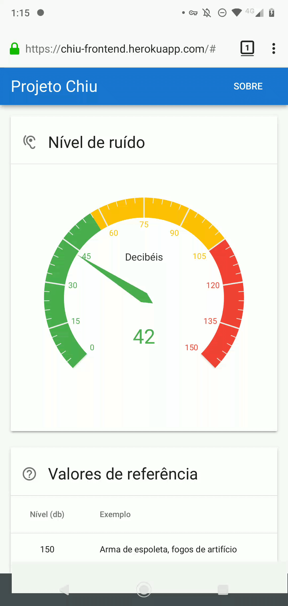
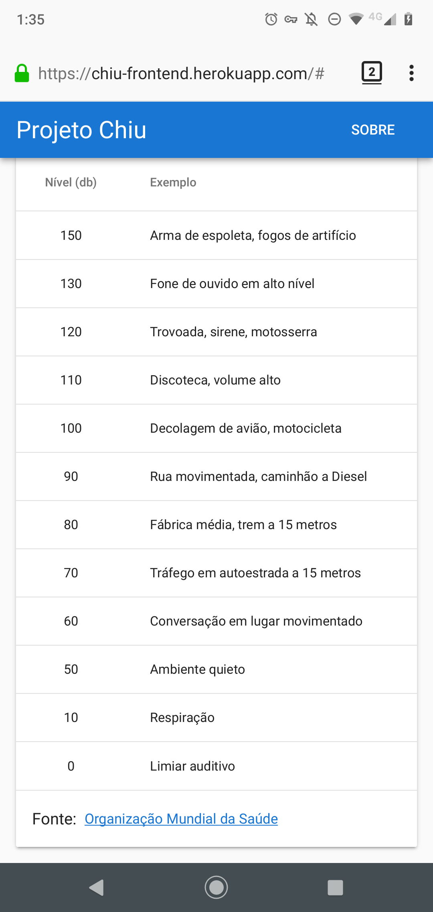

# Project Chiu

Chiu provides a way to monitor the noise level on a given location.

This is an IoT experiment made to help to prevent hearing disability due to noise pollution. The data collected may be useful to identity how the noise pollution has been increasing in some places.

It uses an [Arduino](https://arduino.cc) to capture the noise level in decibels (dB) and send it in real-time to a webserver via [Web Sockets](https://developer.mozilla.org/en-US/docs/Web/API/WebSockets_API). The data sent to the server can be monitored in a website in real-time or using the API based on [Server-Sent Events](https://developer.mozilla.org/en-US/docs/Web/API/Server-sent_events).

The back-end is written in Java and based on Reactor Netty, the data is persisted on Redis and the front-end is written in TypeScript and is based on Vue.

## Preview

| Noise level meter | Reference values |
| :---: | :---: |
|  |  |

## How to run

### Back-end

![jdk]

| Description | Command |
| :--- | :--- |
| Run service | `./gradlew run` |
| Run unit tests | `./gradlew test` |
| Run integration test | `./gradlew itest` |
| Run producer for test | `./gradlew runConsumer` |
| Run consumer for test | `./gradlew runProducer` |
| Run stress tests | `./gradlew gatlingRun` |

[jdk]: https://img.shields.io/badge/jdk-1.8-5481A0.svg?style=for-the-badge "JDK 1.8"

### Front-end

![node] ![npm]

| Description | Command |
| :--- | :--- |
| Install dependencies | `npm install` |
| Run unit tests | `npm run test:unit` |
| Run app for development | `npm run serve` |
| Build app for production | `npm run build` |

[node]: https://img.shields.io/badge/node-12-73B657.svg?style=for-the-badge "Node 12"
[npm]: https://img.shields.io/badge/npm-6-C93B39.svg?style=for-the-badge "NPM 6"

### Hardware

| Description | Command |
| :--- | :--- |
| Arduino support for Visual Studio Code | `ext install vscode-arduino` |

| Quantity | Item | Reference |
| :---: | :--- | :--- |
| 1 | Arduino board | Arduino Uno |
| 1 | Ethernet Shield | HansRun w5100 |
| 1 | Sound meter sensor | KY-038 |

### Infrastructure

![docker] ![compose]

| Description | Command |
| :--- | :--- |
| Provision the database | `docker-compose --file redis.yml up --detach` |
| Connect to the database | `docker exec -it chiu-redis redis-cli -u <url>` |
| Count data persisted on Redis | `INFO keyspace` |

[docker]: https://img.shields.io/badge/docker-19.03-007BFF.svg?style=for-the-badge "Docker 19.03"
[compose]: https://img.shields.io/badge/docker--compose-1.2-039BC6.svg?style=for-the-badge "Docker Compose 1.2"

## How to deploy

![heroku] ![terraform]

The project contains Terraform scripts to deploy modules on Heroku. The commands below need some environment variables to be set before running them.

| Description | Command |
| :--- | :--- |
| Enable Terraform | `terraform init` |
| Deploy backend | `./deploy-backend` |
| Deploy frontend | `./deploy-backend` |
| Generate Heroku OAuth token | `heroku authorizations:create` |
| Revoke Heroku OAuth token | `heroku authorizations:revoke <token>` |

[heroku]: https://img.shields.io/badge/provider-heroku-9E7CC1.svg?style=for-the-badge "Heroku"
[terraform]: https://img.shields.io/badge/terraform-0.12-5C4EE5.svg?style=for-the-badge "Terraform 0.12"
