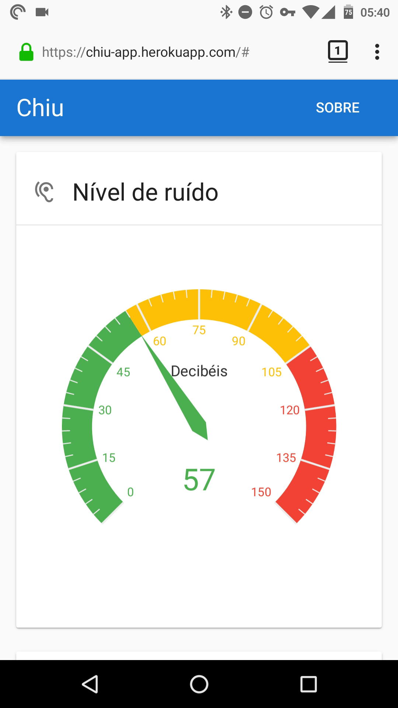

# Project Chiu

Chiu provides a way to monitor the noise level on a given location.

## What and Why 

This is an IoT experiment made to help to prevent hearing disability due to noise pollution. The data collected may be useful to identity how the noise pollution has been increasing in some places.

## How 

It uses an [Arduino](https://arduino.cc) to capture the noise level in decibels (dB) and send it in real-time to a webserver via [Web Sockets](https://developer.mozilla.org/en-US/docs/Web/API/WebSockets_API). The data sent to the server can be monitored in a website in real-time or using the API based on [Server-Sent Events](https://developer.mozilla.org/en-US/docs/Web/API/Server-sent_events).

More details about development environment and build instructions are available in the file [CONTRIBUTING.md](docs/CONTRIBUTING.md).

